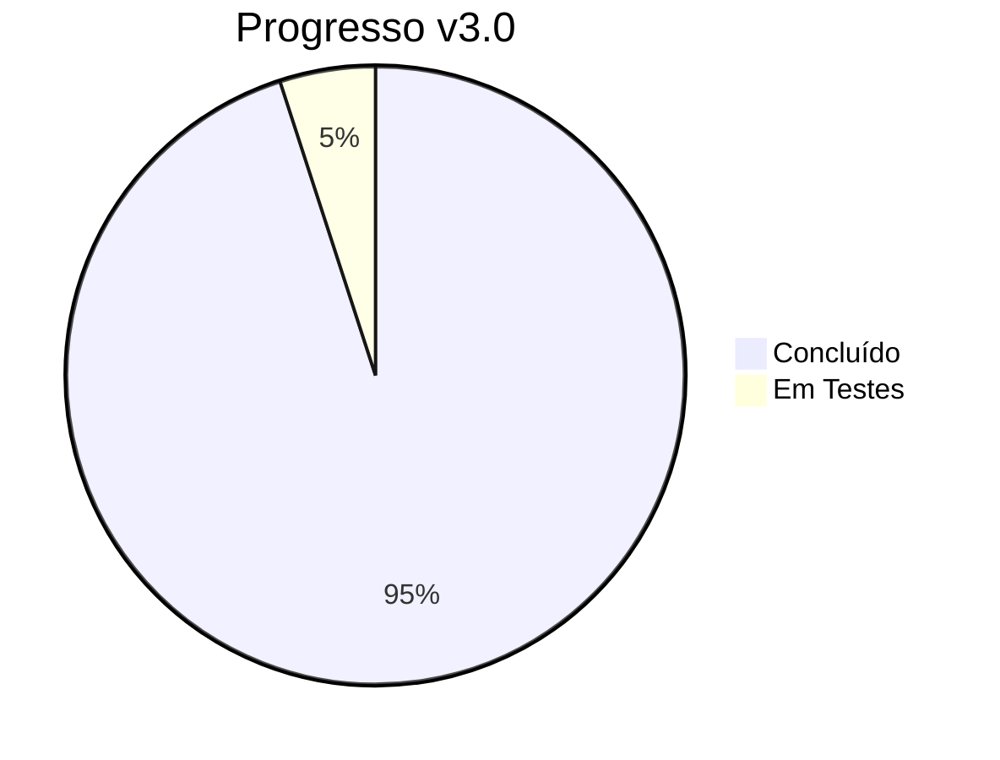
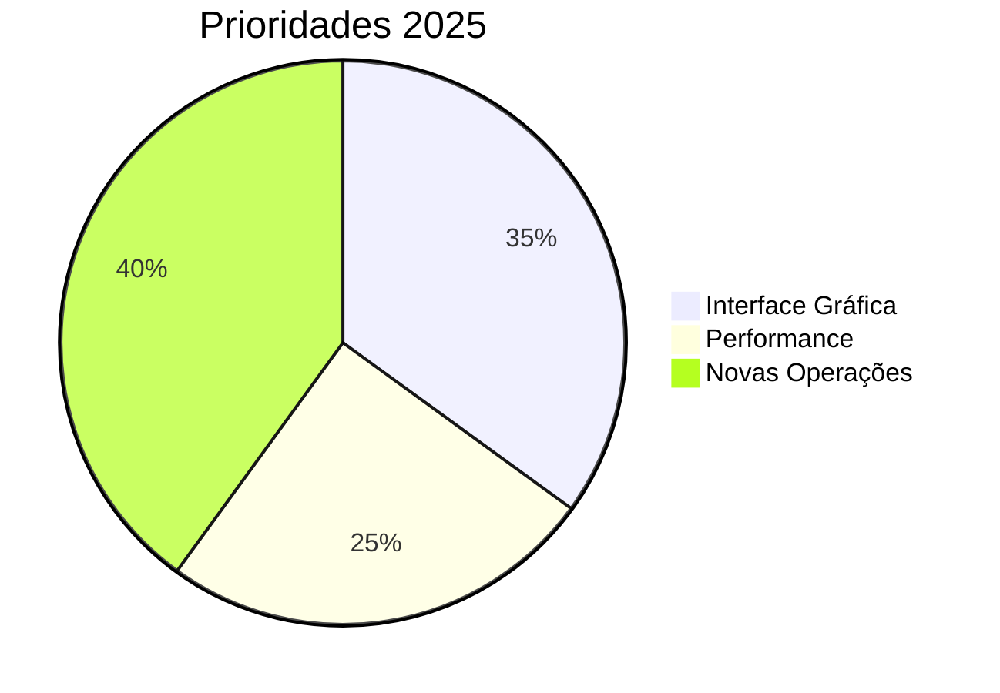
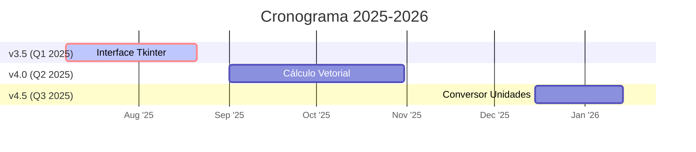
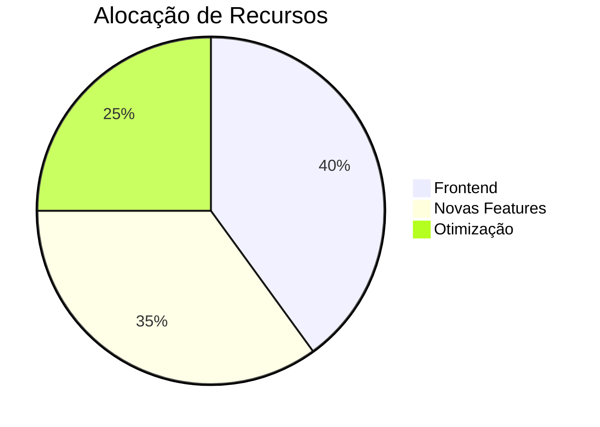
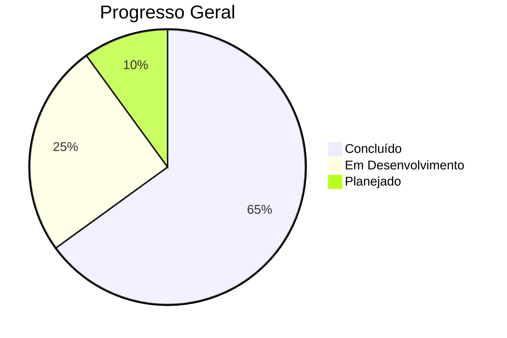
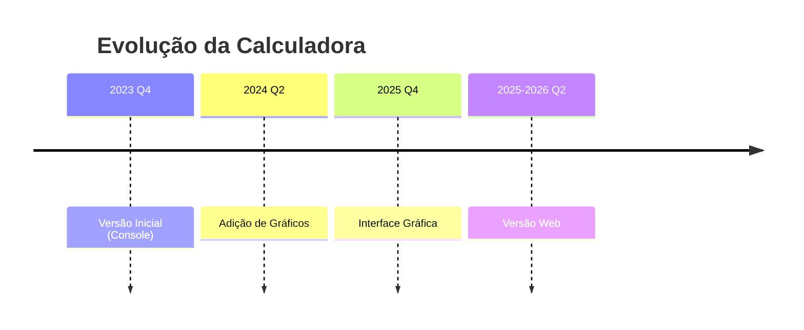

[]()
[]()
[]()
[](https://colab.research.google.com/drive/1hs5znm-lPc-AOodtHnrPCNhMBg8jakax)
[]()
[]()

# Calculadora Científica em Python

Uma calculadora multifuncional para operações matemáticas básicas e avançadas, desenvolvida como projeto educacional em Python.

## 🔍 Navegação

<div align="center">
  <a href="#-funcionalidades">✨ Funcionalidades</a> •
  <a href="#-como-usar">🚀 Como Usar</a> •
  <a href="#-tecnologias">🛠️ Tecnologias</a> •
  <a href="#-roadmap">🗺️ Roadmap</a> •
  <a href="#-autor">👨‍💻 Autor</a>
</div>

## ✨ Funcionalidades

| Categoria           | Operações Disponíveis                          | Opção |
|---------------------|-----------------------------------------------|-------|
| **Básicas**         | Adição, Subtração, Multiplicação, Divisão     | 1 |
| **Potenciação**     | Expoentes, Raízes                             | 2 |
| **Álgebra**         | Equações 1º/2º grau, Fatorial, Logaritmos     | 3-8 |
| **Geometria**       | Teorema de Pitágoras, Trigonometria           | 5,7 |
| **Cálculo**         | Derivadas, Integrais, Gráficos                | 9-11 |
| **Estatística**     | Média, Mediana, Moda, Desvio Padrão           | 12 |
| **Conversões**      | Temperatura, Regra de Três                    | 13-14 |
| **Complexos**       | Operações com números complexos               | 15 |

## 🚀 Como Usar

```bash
# Clone o repositório
git clone https://github.com/LeoMedeiros72/Calculadora-3.0.git
cd Calculadora-3.0


# Instale as dependências
pip install -r requirements.txt

# Execute a calculadora
python calculadora.py
```
# Instruções:

Digite o número correspondente à operação desejada

Siga as instruções específicas de cada operação

Pressione Enter após cada entrada


      
## <span id="tecnologias">🛠️ Tecnologias</span>


## <span id="roadmap">🗺️ Roadmap</span>

### ✅ Versão Atual (v3.0)


#Versão 3.0 - 2024-2025
- [x] ✅ Operações matemáticas básicas e avançadas
- [x] ✅ Suporte a números complexos
- [x] ✅ Sistema de histórico de cálculos
- [x] ✅ Números complexos
- [x] ✅ Geração de gráficos


### Próximas Versões 


**Próximos Passos Imediatos**:
1. [ ] 🖥️ Finalizar GUI (Previsão: Jul/2025)
2. [ ] 📦 Publicar no PyPI
3. [ ] 🧪 Testes E2E

<details> <summary>📊 Métricas Detalhadas</summary>


</details>

**Longo Prazo**:
- [ ] **v4.5**: Integração com Jupyter Notebooks
- [ ] **v5.0**: Versão Web (Streamlit/Dash)
- [ ] **v5.5**: Pacote PyPI com CLI avançado
- [ ] **v6.0**: Versão Mobile (Kivy)

<details> <summary>📊 Métricas de Progresso (Clique para expandir)</summary>
  

</details>


# 📅 Linha do Tempo Visual



- **v3.5 (Jul 2025)**  
  ✅ Interface gráfica básica  
  🏗️ Sistema de plugins

- **v4.0 (Dez 2025)**  
  🔜 Cálculo matricial  
  ⏳ Exportação LaTeX

## 📂 Licença

Este projeto está licenciado sob a licença MIT. Veja o arquivo [LICENSE](LICENSE) para mais detalhes.

## <span id="autor">👨‍💻 Autor</span>

**Leonardo Medeiros**

[](https://github.com/LeoMedeiros72)
[](https://www.linkedin.com/in/leonardo-medeiros-43556b211/)
[](mailto:xorao.lsm@gmail.com)
