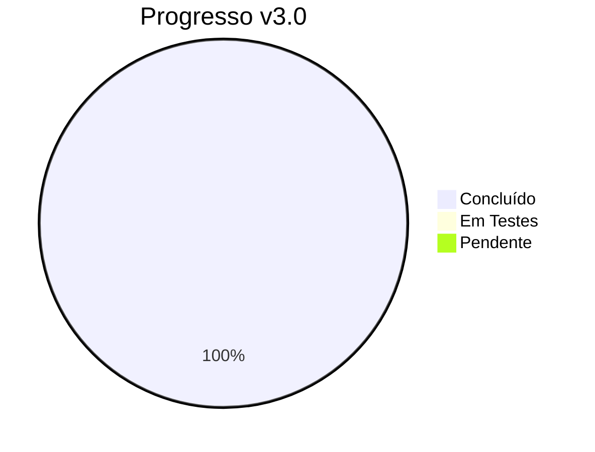
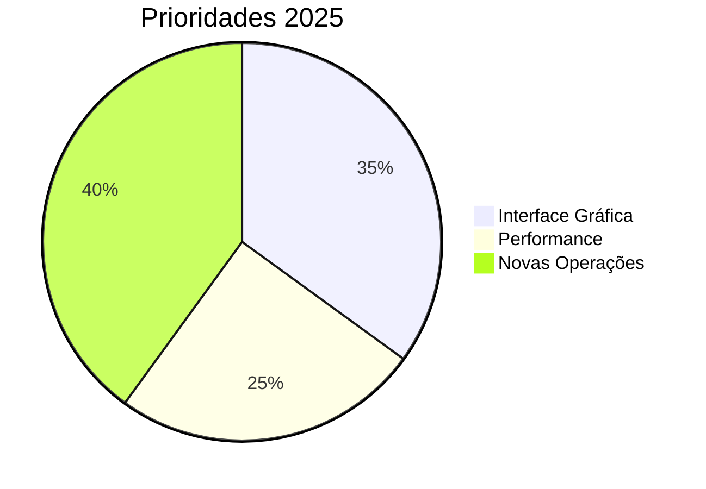
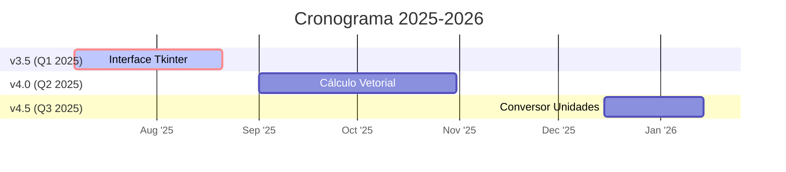
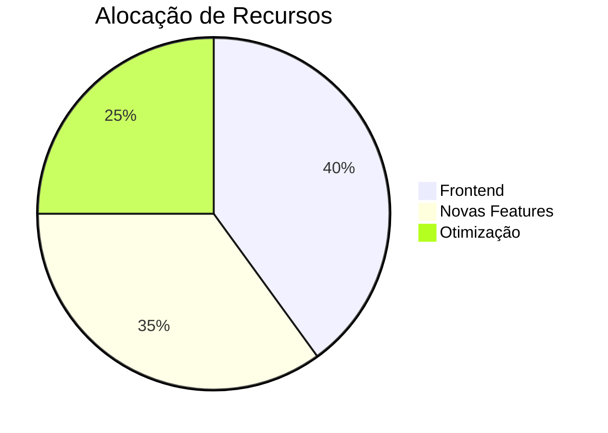
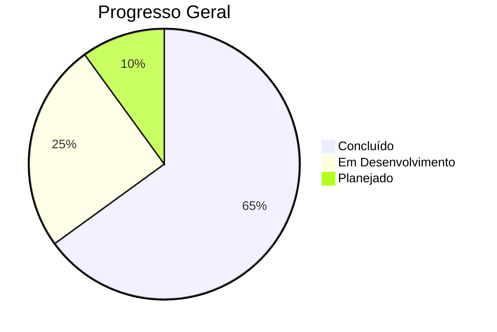
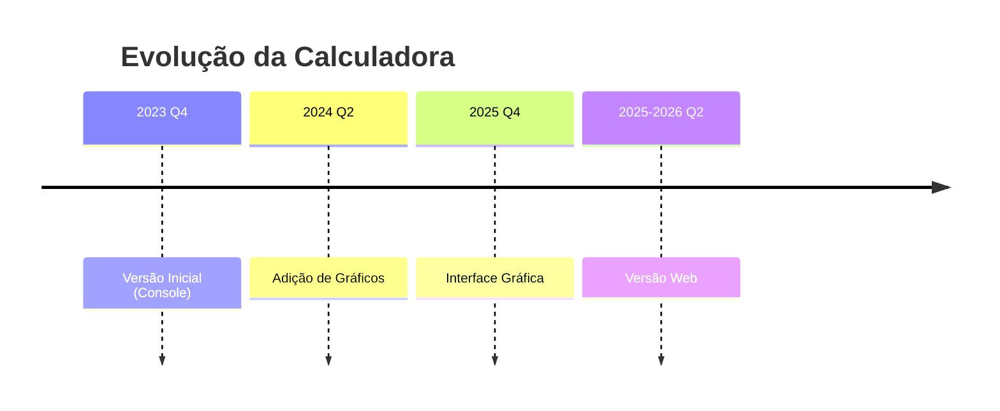

[]()
[]()
[]()
[](https://colab.research.google.com/drive/1hs5znm-lPc-AOodtHnrPCNhMBg8jakax)
[]()
[]()

# Calculadora Científica em Python

Uma calculadora multifuncional para operações matemáticas básicas e avançadas, desenvolvida como projeto educacional em Python.

## 🔍 Navegação

<div align="center">
  <a href="#funcionalidades">✨ Funcionalidades</a> •
  <a href="#como-usar">🚀 Como Usar</a> •
  <a href="#tecnologias">🛠️ Tecnologias</a> •
  <a href="#roadmap">🗺️ Roadmap</a> •
  <a href="#autor">👨‍💻 Autor</a>
</div>

## <span id="funcionalidades">✨ Funcionalidades</span>

| Categoria           | Operações Disponíveis                          |
|---------------------|-----------------------------------------------|
| **Básicas**         | Adição, Subtração, Multiplicação, Divisão     |
| **Potenciação**     | Expoentes, Raízes                             |
| **Álgebra**         | Equações 1º/2º grau, Fatorial, Logaritmos     |
| **Geometria**       | Teorema de Pitágoras, Trigonometria           |
| **Cálculo**         | Derivadas, Integrais, Gráficos                |
| **Estatística**     | Média, Mediana, Moda, Desvio Padrão           |
| **Complexos**       | Operações com números complexos               |
| **Vetores**         | Produto escalar/vetorial, Ângulo entre vetores|

## <span id="como-usar">🚀 Como Usar</span>

```bash
# Clone e execute
git clone https://github.com/LeoMedeiros72/Calculadora-3.0.git
cd Calculadora-3.0
pip install -r requirements.txt
python calculadora.py
```

###   Após isso selecione o número que está relacionado a operação que deseja efetuar:

**1. Operações Básicas (Adição, Subtração, Multiplicação, Divisão)**

**2. Potenciação**

**3. Radiciação**

**4. Fatorial**

**5. Teorema de Pitágoras**

**6. Equações do 1º e 2º grau**

**7. Trigonometria (Seno, Cosseno, Tangente)**

**8. Logaritmos**

**9. Derivada de uma Função**

**10. Integral de uma Função**

**11. Gráfico de Função**

**12. Cálculo Estatístico (Média, Mediana, Moda, Variância, Desvio Padrão)**

**13. Regra de Três (Diretamente ou Inversamente Proporcional)**

**14. Conversão de Temperatura**

**15. Números Complexos**

**16. Ver histórico**

###   Para sair da calculadora digite o núemro abaixo:   

**17. Sair**


      
## <span id="tecnologias">🛠️ Tecnologias</span>

- **Python 3.12**: Linguagem de programação principal.
- **Biblioteca Math**: Para cálculos matemáticos avançados.
- **Matplotlib**: Para geração de gráficos.
- **NumPy**: Para manipulação de arrays e cálculos numéricos.
- **Biblioteca quad do pacote cipy.integrate**: Para cálculo de integrais
- **Biblioteca findiff**: Para cálculo de derivadas
- **Biblioteca statistics**: Para cálculos estatísticos

## <span id="roadmap">🗺️ Roadmap</span>

### ✅ Versão Atual (v3.0)


#Versão 3.0 - 2024-2025
- [x] ✅ Operações matemáticas básicas e avançadas
- [x] ✅ Suporte a números complexos
- [x] ✅ Sistema de histórico de cálculos
- [x] ✅ Números complexos
- [x] ✅ Geração de gráficos


### Próximas Versões 


**Próximos Passos Imediatos**:
1. [ ] 🖥️ Finalizar GUI (Previsão: Jul/2025)
2. [ ] 📦 Publicar no PyPI
3. [ ] 🧪 Testes E2E

<details> <summary>📊 Métricas Detalhadas</summary>


</details>

**Longo Prazo**:
- [ ] **v4.5**: Integração com Jupyter Notebooks
- [ ] **v5.0**: Versão Web (Streamlit/Dash)
- [ ] **v5.5**: Pacote PyPI com CLI avançado
- [ ] **v6.0**: Versão Mobile (Kivy)

<details> <summary>📊 Métricas de Progresso (Clique para expandir)</summary>
  

</details>


# 📅 Linha do Tempo Visual



- **v3.5 (Jul 2025)**  
  ✅ Interface gráfica básica  
  🏗️ Sistema de plugins

- **v4.0 (Dez 2025)**  
  🔜 Cálculo matricial  
  ⏳ Exportação LaTeX

## 📂 Licença

Este projeto está licenciado sob a licença MIT. Veja o arquivo [LICENSE](LICENSE) para mais detalhes.

## <span id="autor">👨‍💻 Autor</span>

**Leonardo Medeiros**

[](https://github.com/LeoMedeiros72)
[](https://www.linkedin.com/in/leonardo-medeiros-43556b211/)
[](mailto:xorao.lsm@gmail.com)
